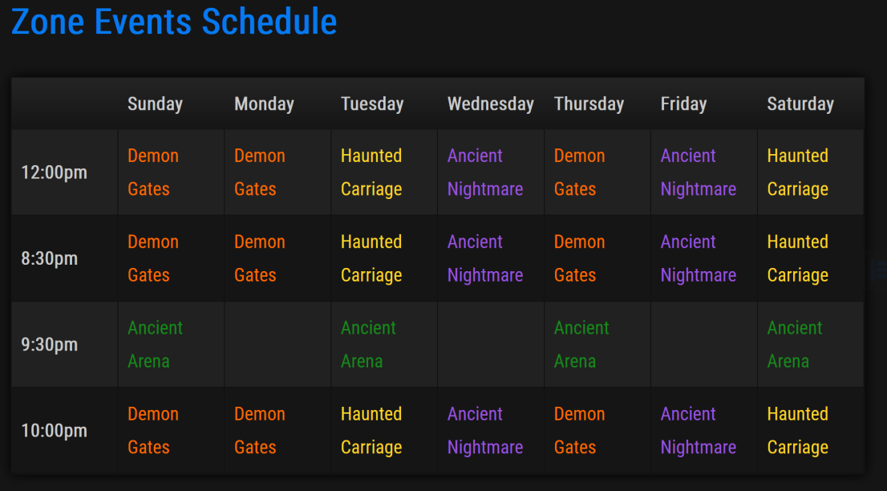
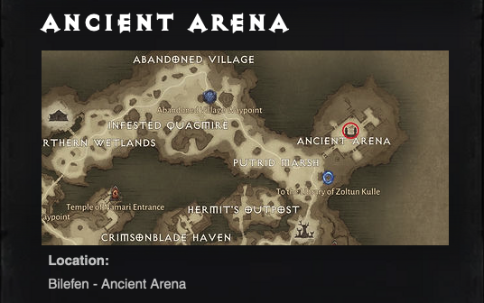
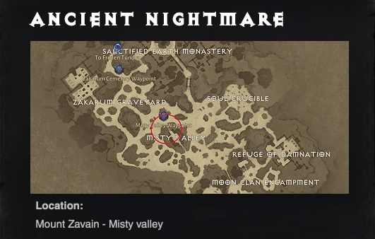
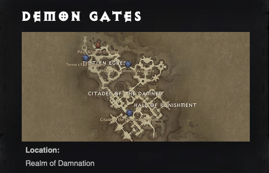
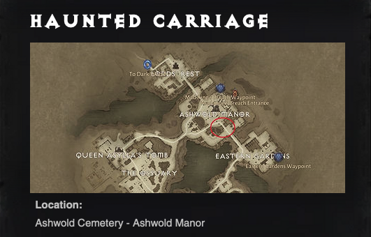

[Back](../)

# World Map
- [Bilefen](./bilefen/)
- [Dark Wood](./darkwood/)
- [Fronzen Tundra](./tundra/)
- [Library of Zoltun Kulle](./library/)
- [Mount Zavain](./zavain/)
- [Shassar Sea](./shassar/)

# Links

Links:
- [Map Genie - Diablo Immortal](https://mapgenie.io/diablo-immortal/)
- [Map App](https://diablo-immortal-map.appsample.com/)
- [Diablo Timer](https://www.diablotimer.com/?fbclid=IwAR2idHmXOFCO4Aa7O3KjfaA1uD-m14gZVxNrsB1YTLjXUJffoYb0Beh40Bg)

----

# World Zone Events Schedule

 Time | Sunday | Monday | Tuesday | Wednesday | Thursday | Friday | Saturday
------|--------|--------|---------|-----------|----------|--------|---------
12:00pm (2:00pm NZ) | Demon Gates | Demon Gates | Haunted Carriage | Ancient Nightmare | Demon Gates | Ancient Nightmare | Haunted Carriage 
08:30pm (10:30pm NZ) | Demon Gates | Demon Gates | Haunted Carriage | Ancient Nightmare | Demon Gates | Ancient Nightmare | Haunted Carriage
09:30pm (11:30pm NZ) | Ancient Arena | | Ancient Arena | | Ancient Arena | | Ancient Arena
10:00pm (12:00am NZ) | Demon Gates | Demon Gates | Haunted Carriage | Ancient Nightmare | Demon Gates | Ancient Nightmare | Haunted Carriage

----

# WORLD EVENTS

----

# Ancient Arena @ Bilefen

----

# Ancient Nightmare @ MountZavain

----

# Demon Gates @ Realm of Damnation

----

# Haunted Carriage @ Ashwold Cemetery

[Back](../)
